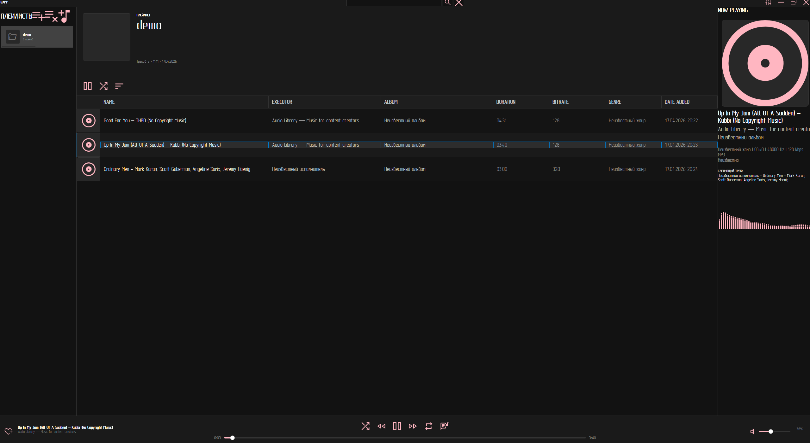
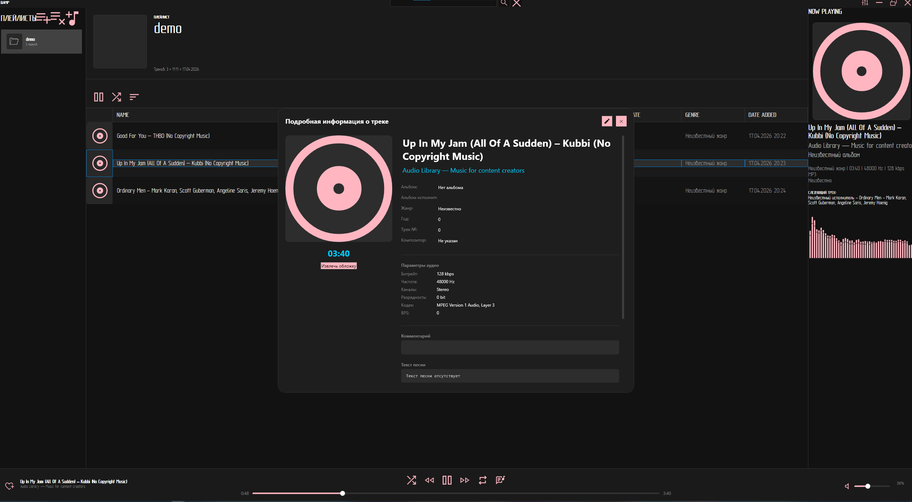
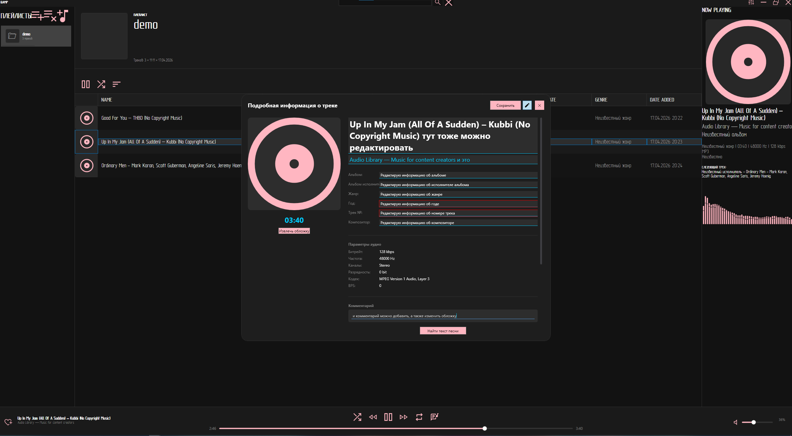
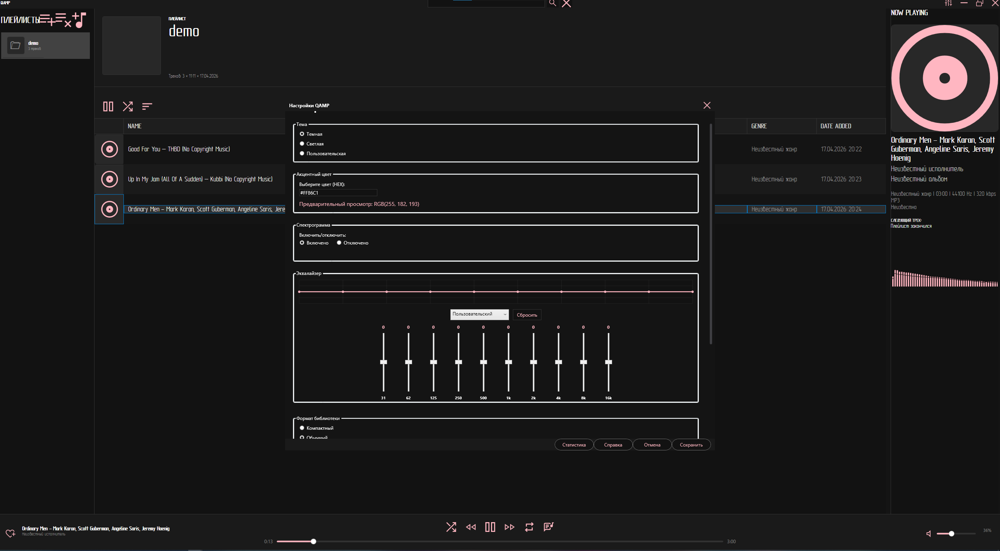

# **QAMP** - достаточно легкий музыкальный плеер на базе .NET, созданный в первую очередь для меня.

## Основные возможности:
    Поддержка Hi-Res Audio (FLAC, WAW, MP3 и другие)  
    Визуализация: Встроенный и отключаемый спектр и эквалайзер  
    Статистика: Подробный анализ прослушиваний (Топ 10 треков, вес библиотеки, длительность библиотеки и другое)  
    Современный UX: Сворачивание в трей, предотварщение запуска несколько копий  

## Технологический стек:
    Язык: C#  
    Платформа: .NET 10.0  
    Интерфейс: WPF  
    Звуковой движок: NAudio  
    Спектр: ScottPlot  
    БД: SQLite  
    Работа с тегами: TagLibSharp
## Быстрый старт:
Скачайте последнию версию из [Releases](https://github.com/d3solat1on/QAMP/releases)  
Запустите установщик  
Готово.  
## Если ж вы хотите собрать проект самостоятельно, то:
`git clone https://github.com/d3solat1on/QAMP.git`  
`cd QAMP`  
`dotnet restore`  
`dotnet build`  
### Скриншоты:

Нажми, чтобы посмотреть скриншоты

